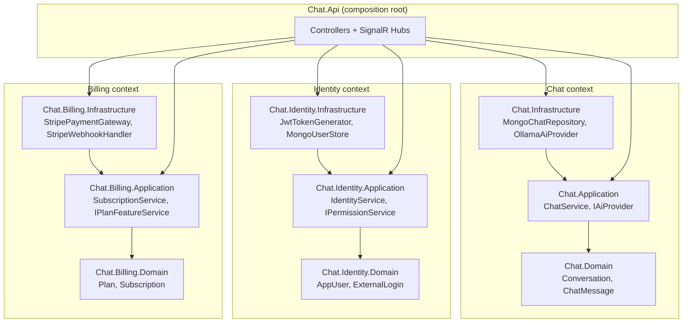
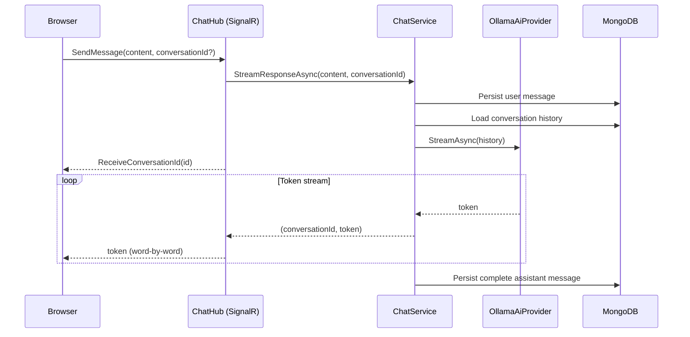

# ChatApp — Real-time AI Chat Application

A ChatGPT-style chat application built end-to-end with Clean Architecture, TDD, and a modern real-time stack. Features word-by-word streaming responses from a local LLM, JWT/OAuth authentication, role-based authorization with permission policies, and Stripe billing — all separated into independent bounded contexts.


---

## Features

- **Real-time streaming** — word-by-word LLM responses via SignalR `IAsyncEnumerable<string>`
- **Local LLM integration** — Ollama-backed AI provider with a swappable `IAiProvider` interface
- **Authentication** — JWT access tokens and Google OAuth 2.0
- **Authorization** — role-based permission policies (`CanChat`, `AdminOnly`, etc.) with 5-minute cached role lookups
- **Billing** — Stripe Checkout, webhook-driven subscription lifecycle, plan-based feature gating
- **Persistence** — MongoDB 7 via Docker Compose with typed document mappings
- **Testing** — 119 automated tests across 3 levels (unit, integration, E2E) following strict TDD

---

## Architecture

The codebase is split into three independent **bounded contexts** (Chat, Identity, Billing), each following **Clean Architecture** layering (Domain → Application → Infrastructure → API). Only the API project references all three contexts for dependency injection wiring.

### Bounded contexts × layers



### Streaming chat request flow



---

## Tech Stack

| Category | Technology |
|----------|-----------|
| Backend | .NET 8, ASP.NET Core (Controllers), SignalR |
| Frontend | React 19, TypeScript 5, Vite, MUI |
| Database | MongoDB 7 (Docker Compose) |
| Real-time | SignalR with `IAsyncEnumerable` server streaming |
| AI / LLM | Ollama (OllamaSharp 4.0) — local inference, swappable via `IAiProvider` |
| Payments | Stripe (Stripe.net 45) — Checkout + webhooks |
| Auth | JWT bearer tokens + Google OAuth 2.0 |
| Authorization | ASP.NET Core policies + custom `IPermissionService` with memory cache |
| Testing | xUnit, FluentAssertions, Vitest, React Testing Library, Playwright |
| Infrastructure | Docker Compose (MongoDB 7 + Mongo Express) |

---

## Project Structure

```
backend/
├── src/
│   ├── Chat.Api/                     # Composition root — controllers, hubs, DI
│   ├── Chat.Domain/                  # Conversation, ChatMessage entities
│   ├── Chat.Application/             # ChatService, IAiProvider, DTOs
│   ├── Chat.Infrastructure/          # MongoChatRepository, OllamaAiProvider
│   ├── Chat.Identity.Domain/         # AppUser, ExternalLogin
│   ├── Chat.Identity.Application/    # IdentityService, IPermissionService
│   ├── Chat.Identity.Infrastructure/ # JwtTokenGenerator, MongoUserStore
│   ├── Chat.Billing.Domain/          # Plan, Subscription, Feature enum
│   ├── Chat.Billing.Application/     # SubscriptionService, IPlanFeatureService
│   └── Chat.Billing.Infrastructure/  # StripePaymentGateway, StripeWebhookHandler
└── tests/                            # xUnit test projects per layer
frontend/chat-ui/                     # React 19 + Vite + TypeScript + MUI
e2e/playwright/                       # Playwright E2E tests
docker-compose.yml                    # MongoDB 7 + Mongo Express
```

---

## Getting Started

### Prerequisites

- [Docker](https://www.docker.com/) (for MongoDB)
- [.NET 8 SDK](https://dotnet.microsoft.com/download)
- [Node.js 20+](https://nodejs.org/)
- [Ollama](https://ollama.com/) with a pulled model (default: `gemma3:4b` ≈ 3 GB — use `gemma3:2b` ≈ 1.5 GB for lighter setup)

### Happy path (chat works, no OAuth or billing setup needed)

```bash
# 1. Start MongoDB
docker compose up -d

# 2. Pull the LLM model
ollama pull gemma3:4b

# 3. Start the backend (terminal 1)
cd backend
dotnet run --project src/Chat.Api

# 4. Start the frontend (terminal 2)
cd frontend/chat-ui
npm install
npm run dev
```

Open http://localhost:5173. Register with email + password, then chat.

<details>
<summary><b>Optional: enable Google OAuth login</b></summary>

1. Create OAuth credentials at [Google Cloud Console](https://console.cloud.google.com/apis/credentials)
2. Authorized redirect URI: `http://localhost:5064/auth/callback/google`
3. Set values in `backend/src/Chat.Api/appsettings.Development.json`:
   ```json
   "Google": {
     "ClientId": "your-client-id.apps.googleusercontent.com",
     "ClientSecret": "your-client-secret"
   }
   ```
4. Restart the backend. A "Sign in with Google" button appears on the login page.

</details>

<details>
<summary><b>Optional: enable Stripe billing</b></summary>

1. Get test-mode keys from [Stripe Dashboard](https://dashboard.stripe.com/test/apikeys)
2. Create two test-mode products (Pro and Enterprise) and copy their price IDs
3. Set values in `backend/src/Chat.Api/appsettings.json`:
   ```json
   "Stripe": {
     "SecretKey": "sk_test_...",
     "WebhookSecret": "whsec_...",
     "PriceIds": {
       "Pro": "price_...",
       "Enterprise": "price_..."
     }
   }
   ```
4. Run the Stripe CLI to forward webhooks during local dev:
   ```bash
   stripe listen --forward-to localhost:5064/webhooks/stripe
   ```
5. The "Manage Plan" button in the chat header opens the billing page.

</details>

---

## Running Tests

```bash
# Backend (xUnit + FluentAssertions)
dotnet test backend/ChatApp.sln

# Frontend (Vitest + React Testing Library)
cd frontend/chat-ui
npm test

# E2E (Playwright — Chromium)
cd e2e/playwright
npx playwright test
```

**Test counts:** 58 backend + 61 frontend = **119 total**, all passing.

> The MongoDB integration tests require Docker Compose to be running. All other tests run without external dependencies (API tests use an in-memory `IChatRepository`, a fake `IAiProvider`, and a test auth handler — see `ChatApiFactory` and `AuthApiFactory`).

---

## Architecture Decisions

Four non-obvious decisions worth calling out. Each reflects a real trade-off rather than a copied template.

### 1. `IAiProvider` abstraction in Application, `OllamaAiProvider` in Infrastructure

The Application layer defines *what it needs* (`IAiProvider` with `StreamAsync(IReadOnlyList<ChatMessage>)`), and Infrastructure supplies the concrete implementation. Tests inject a `FakeAiProvider` that yields a predictable string; swapping Ollama for OpenAI, Anthropic, or Azure OpenAI would touch only one file in Infrastructure. This is dependency inversion applied to the fastest-moving part of the system — LLM provider churn.

### 2. Three bounded contexts: Chat / Identity / Billing

Instead of one monolithic `Chat.Domain`, each concern is its own independent context with its own Domain, Application, and Infrastructure projects. They share only `Guid UserId` across boundaries — no entity leakage, no cross-context imports. The payoff: adding Stripe billing didn't force changes to messaging or auth; adding Google OAuth didn't force changes to billing. Context boundaries are enforced by project references at compile time, not by discipline at review time.

### 3. SignalR server streaming with `IAsyncEnumerable<(Guid, string)>`

The hub method returns `IAsyncEnumerable<string>` directly — no custom message protocol, no manual connection lifecycle. SignalR handles backpressure, cancellation, and delivery. The tuple carries the `conversationId` on every yield so the client can associate streamed tokens with the right conversation. A separate `ReceiveConversationId` message fires before the first token so the UI can update routing state before any render.

### 4. Feature gating via `IPlanFeatureService` in `Chat.Billing.Application`

Cross-cutting concerns often end up in the wrong layer. Feature flags aren't an Identity concern (they're not about *who* you are) and aren't a Chat concern (they're not about *how* messaging works) — they're a billing concern (what your plan *entitles* you to). `ChatHub` calls `IPlanFeatureService.IsFeatureEnabled(userId, Feature.Chat)` before streaming; `RealPlanFeatureService` lives in Billing.Infrastructure and makes the subscription/plan decision. Placing the interface in the billing context, not in `Chat.Application`, is what keeps the dependency graph one-way.

---

## Author

Built by **Asif Md Arshadullah**

- GitHub: [@asif-arshadullah](https://github.com/asif-arshadullah)
- LinkedIn: [asif-arshadullah](https://www.linkedin.com/in/asif-arshadullah)

---

## License

MIT — see [LICENSE](LICENSE).
