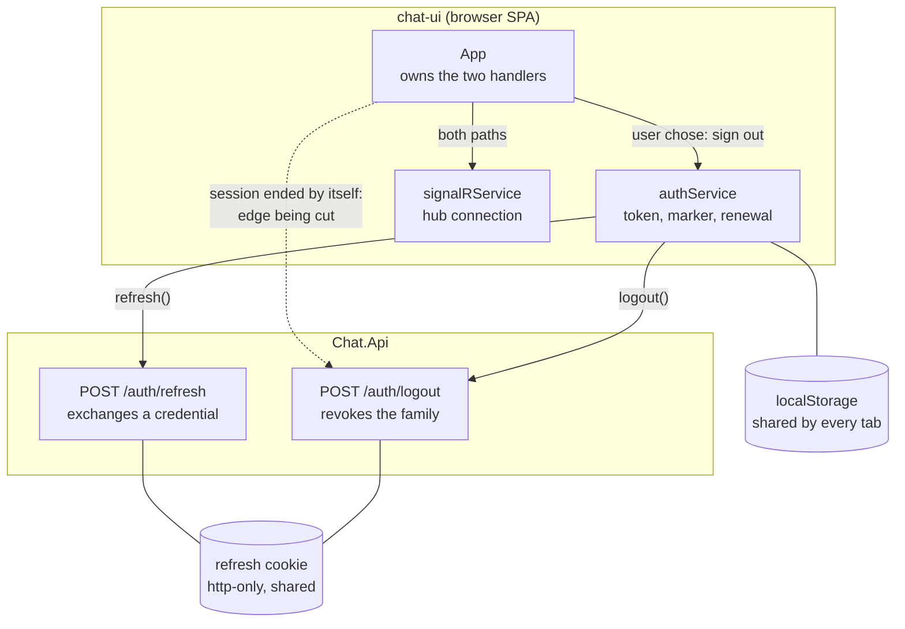
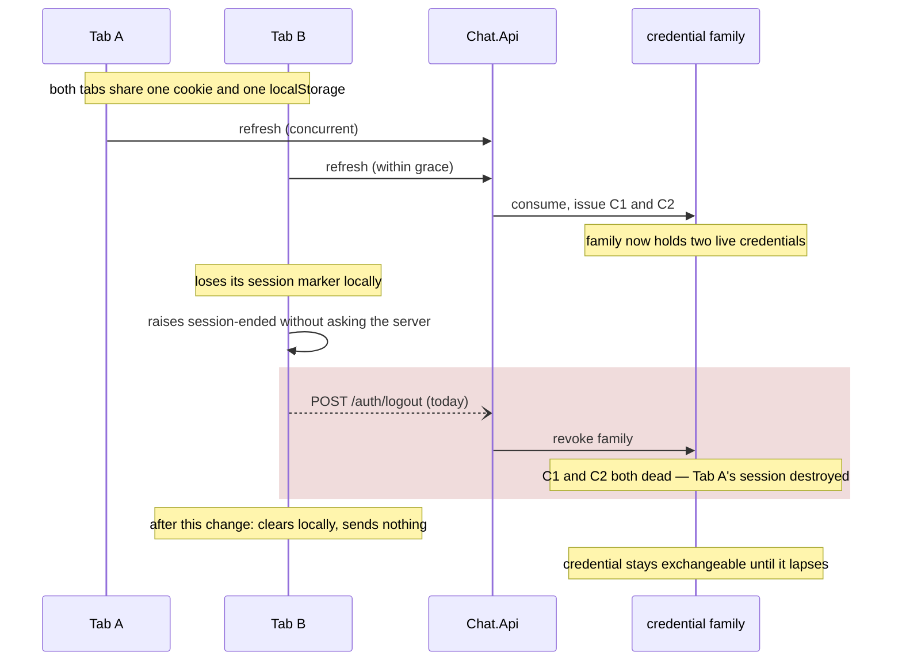

## Context

See proposal.md — Why.

The whole change sits in `frontend/chat-ui/src/App.tsx`. `endSession` currently serves both
`onLogout` and `onSessionExpired`:

```
signalRService.stop(); authService.logout(); setIsAuthenticated(false)
```

`authService.logout()` POSTs `/auth/logout` and then clears locally; `authService.clearLocal()`
does the clearing alone and is already public. `signalRService.stop()` is wanted either way.

Two facts from the spike, which are the reason this is worth doing:

- A family can hold more than one live credential. Concurrent renewal within the grace window
  issues a second credential in the same family, so the family is not a synonym for "the one
  credential this client holds".
- `LogoutAsync` revokes by family, from whatever credential is presented — including one the
  server considers spent. So a stale cookie is enough to destroy a live sibling credential.

The route that makes this reachable is `getValidToken` raising the session-ended signal
*without contacting the server*, when no session marker is found. The refresh cookie is
http-only, so the client cannot see whether it is still good — and in that case it often is.

## Diagrams

Two levels answer real questions here. System context and container are omitted: the scope is
one browser SPA talking to one API, which the README already covers, and nothing about the
deployment topology bears on this change.

### Component — inside the chat-ui container

The question this answers: which edge is being cut, and what stays.



- `App` is the only component that knows *why* a session is ending; the services below it see
  only the call. That is why the distinction is made there and not pushed into `authService`.
- The dashed edge is what this change removes. Every other edge stays exactly as it is.
- `localStorage` and the refresh cookie are both shared across tabs, which is what makes a
  revocation felt by clients that never asked for it.

### Dynamic — the harm, and what replaces it

The question this answers: how a session that was recoverable gets destroyed.



- The shaded block is the defect: a client that never contacted the server nonetheless tells it
  to revoke, on the strength of a local conclusion.
- The grace exchange is what puts two live credentials in one family, so the blast radius is
  wider than the tab that acted.

**Assumptions.** Both tabs are same-origin in one browser profile, so they share the cookie
jar and `localStorage`. Two live credentials in one family was verified by spike rather than
assumed.

**Open questions.** None that change this design. Whether an abandoned session should later
attempt recovery against the surviving credential is deliberately deferred — see Non-Goals.

## Goals / Non-Goals

**Goals:**

- Make revocation follow intent. Only a user's sign-out revokes.
- Make the distinction visible at the call site, so the next person wiring a handler has to
  choose rather than inherit.

**Non-Goals:**

- The proposal's non-goals carry over: no server change, no recovery semantics, orphaned
  credential accepted.
- Not auditing every path that can raise the session-ended signal. The signal's meaning is
  what changes; its sources stay as they are.

## Decisions

### Fix the client, not the server

The harm needs both halves — a client that signs out on an expiry, and a server that revokes a
family for any credential presented — but only one half is wrong. Family-wide revocation is
correct for a deliberate sign-out, and it is the same rule that makes replay detection work: a
replayed credential must take down every credential in its family or the attacker keeps the
session.

Narrowing the server was considered and rejected. A user who signs out during a renewal race
would leave a live credential behind, which is precisely what sign-out promises not to do.
The client is where the intent is known, so the client is where the distinction belongs.

### Two named functions, not one function with a flag

`endSession` keeps its name, its `authService.logout()` call, and its wiring to `onLogout`. A
second function — `abandonSession` — stops the hub, calls `clearLocal`, and takes
`onSessionExpired`.

A boolean parameter (`endSession(deliberate: boolean)`) was the alternative. Rejected because
it reproduces the fault being fixed: the current bug exists precisely because one function
served two intentions and the call sites did not have to say which they meant. A name at the
call site is the fix.

Pushing the distinction into `authService` (an `abandon()` beside `logout()`) was also
considered. Rejected as premature: `abandonSession` is one existing public method plus a hub
stop, and the hub is not the auth service's concern.

### Abandonment clears everything, including the session marker

`clearLocal` already removes the token, the expiry, the session marker and the companion
cookie. Keeping the marker so that the next load could attempt recovery against the surviving
cookie is genuinely attractive — the cookie is often still good, which is the whole premise of
this change — but it converts this into a change about recovery, with a restore-fail-bounce
loop to design against. One idea per change; the recovery question is worth its own.

### The orphaned credential is accepted rather than reaped eagerly

Leaving a live credential behind is the direct consequence of not revoking. It is bounded by
its own lifetime — up to a day for a remembered session — and the system already removes
credentials once they stop being usable. It is http-only and sits in the browser that just
failed to use it. An expiry is not evidence of compromise, and an attacker who holds the
cookie could already exchange it before any of this.

## Risks / Trade-offs

- **A session that should have ended keeps an exchangeable credential** → Bounded by the
  credential's own lifetime and the existing reaper. The user-visible session is over either
  way: the client holds no access token and shows sign-in.
- **The test that matters is a request that does not happen** → Asserting absence is weak on
  its own; the Playwright test that shows the credential still exchanges afterwards is what
  demonstrates the harm is gone. Both belong in the change.
- **Someone re-wires `onSessionExpired` to `endSession` later** → The names are the guard, and
  the unit test that an expiry makes no `/auth/logout` request fails if they are swapped.
- **The spike's evidence is not preserved as tests** → The three spike tests characterised
  intended server behaviour rather than anything this change alters; keeping them would imply
  that behaviour is at risk here. The reasoning lives in this document instead, which is where
  a future reader would look for why the client must not call sign-out.
